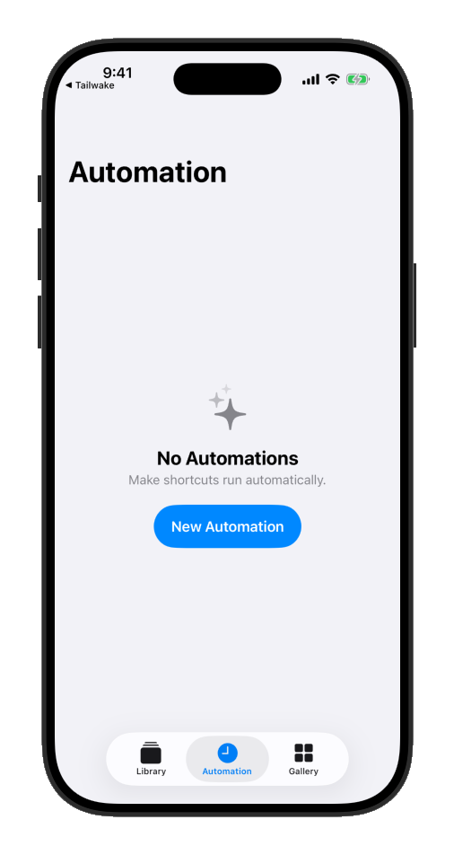
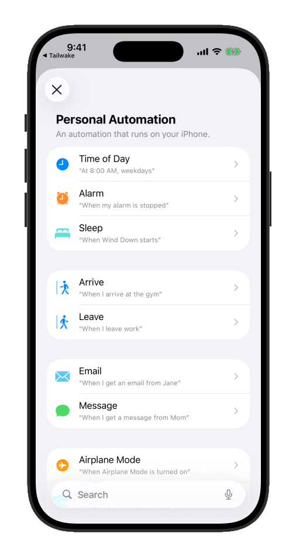
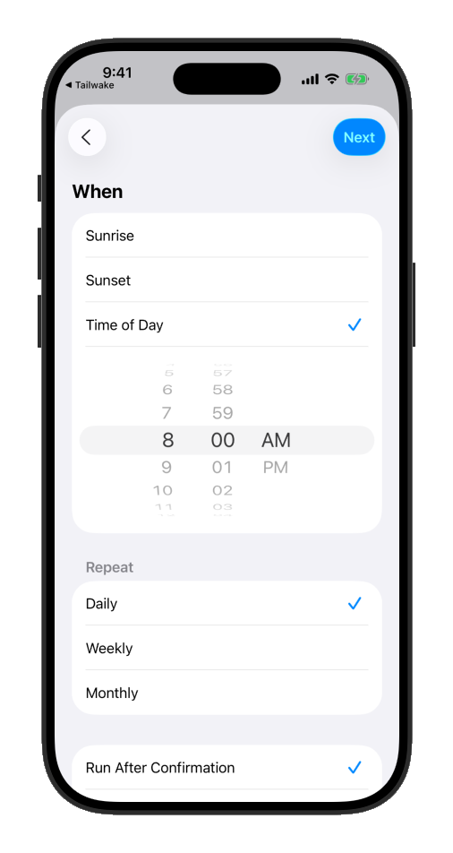
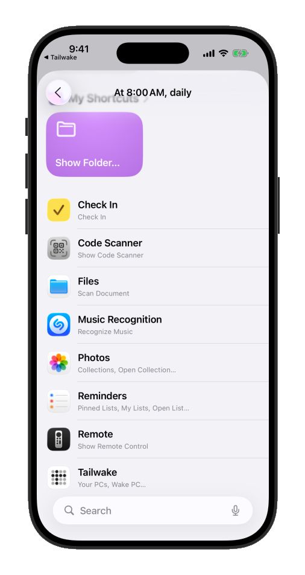
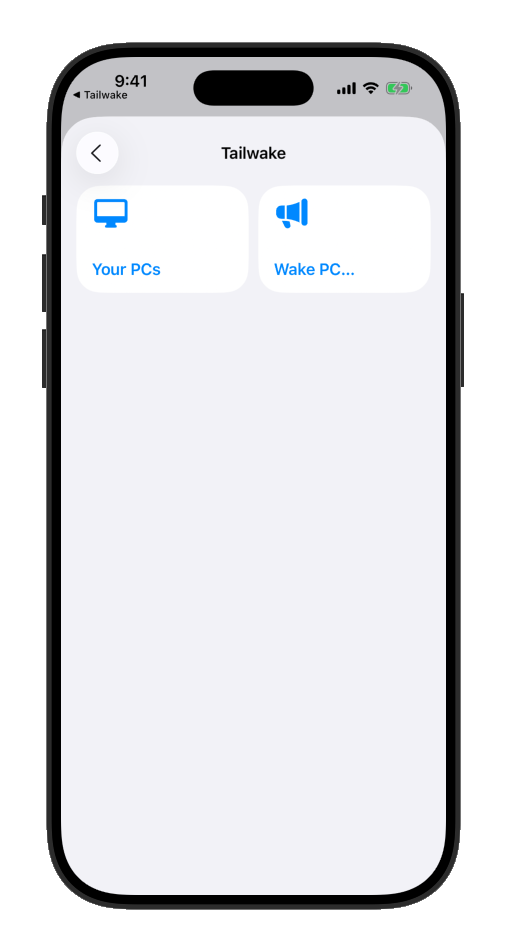
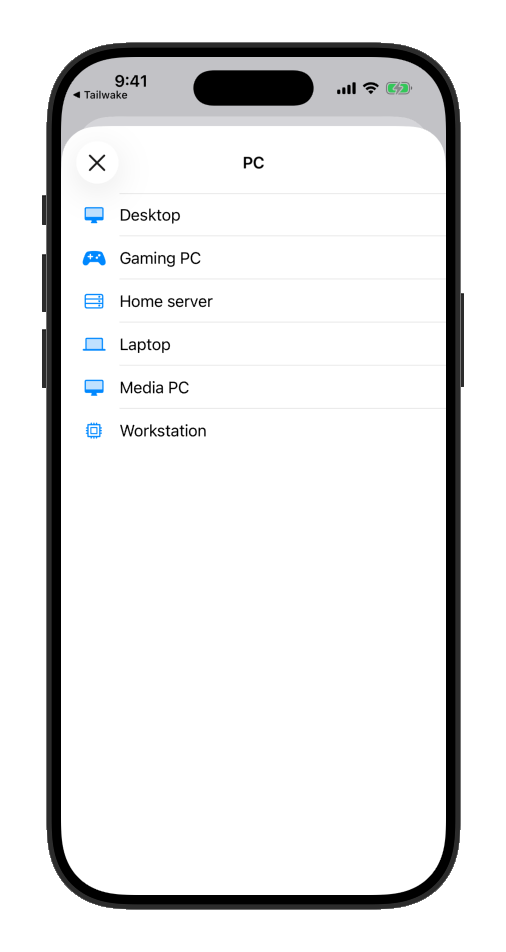
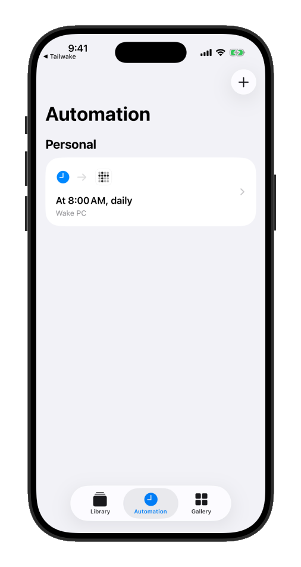

# Automate wakes

[← Tailwake home](README.md) · [Instructions](INSTRUCTIONS.md) · [Support Development](SUPPORT.md) · [Privacy Policy](PRIVACY.md) · [Terms of Use](TERMS.md)

Tailwake sets up a **Wake PC** action in Siri and Shortcuts for every saved PC, so you can wake one without opening the app — by voice, on a schedule, or from another shortcut.

## Wake a PC by voice

Say **“Tailwake” followed by the PC's name** — for example, “Hey Siri, Tailwake Desktop” — to wake it.

## Create a daily wake automation

This walks through waking a saved PC — named “Desktop” here — automatically every morning at 8:00 AM, using the Shortcuts app's Personal Automations. Substitute your own PC's name and time.

1. Open **Shortcuts** and go to the **Automation** tab.

   

2. Tap **New Automation**, then choose **Time of Day**.

   

3. Set the time to **8:00 AM**, keep **Repeat** set to Daily, then tap **Next**.

   

4. Scroll down to find **Tailwake** among your installed apps.

   

5. Tap **Tailwake**, then tap **Wake PC…**.

   

6. Choose the PC to wake — **Desktop**, for this example.

   

7. The automation is ready.

   

By default, the automation is set to **Run After Confirmation**, so iOS asks before it wakes the PC each morning. To run it silently, open the automation, tap the **Automation** row at the top, and switch it to **Run Immediately**.

For relay-wake limits, subscriptions, and optional tips, see [Support Development](SUPPORT.md).
