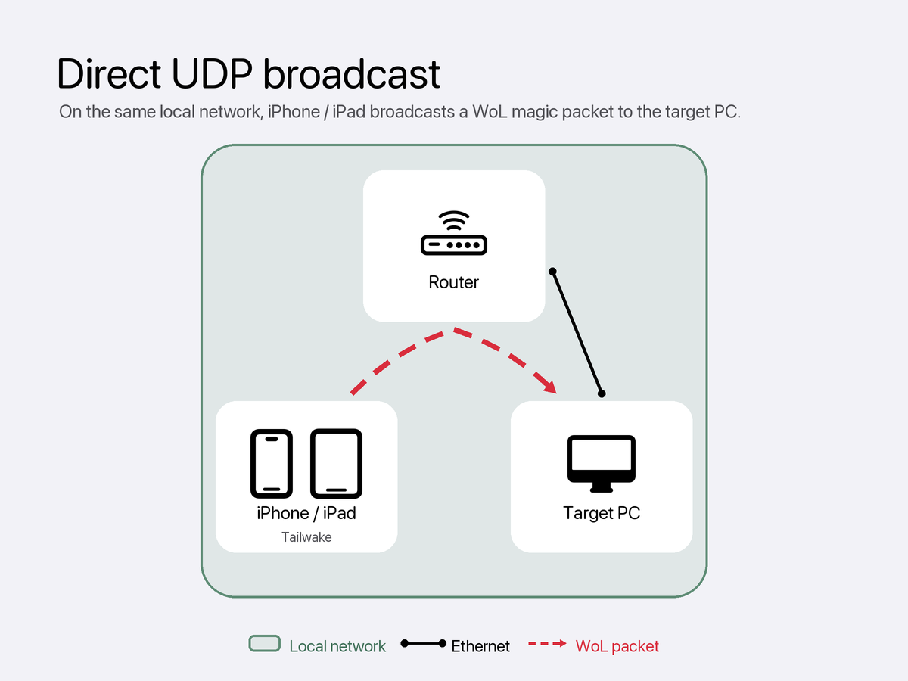
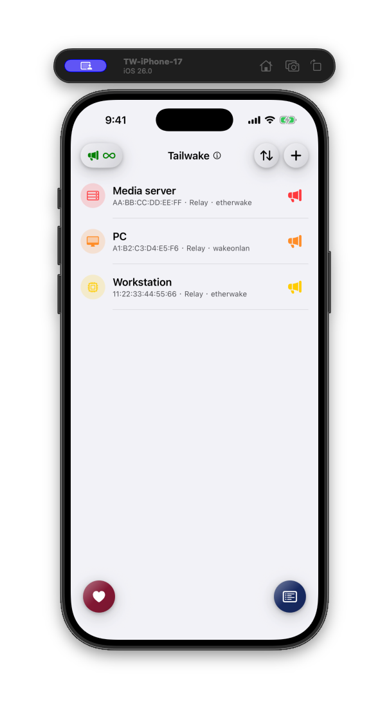
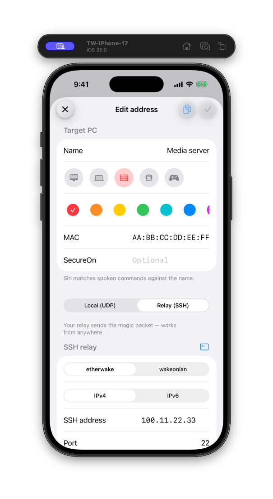
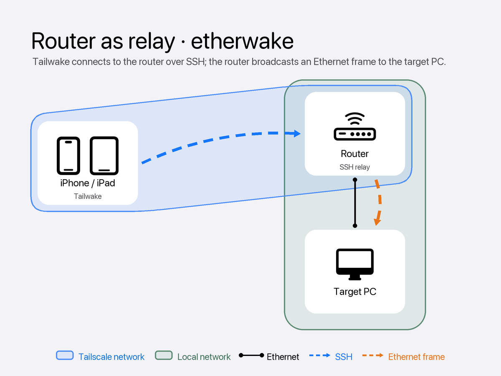
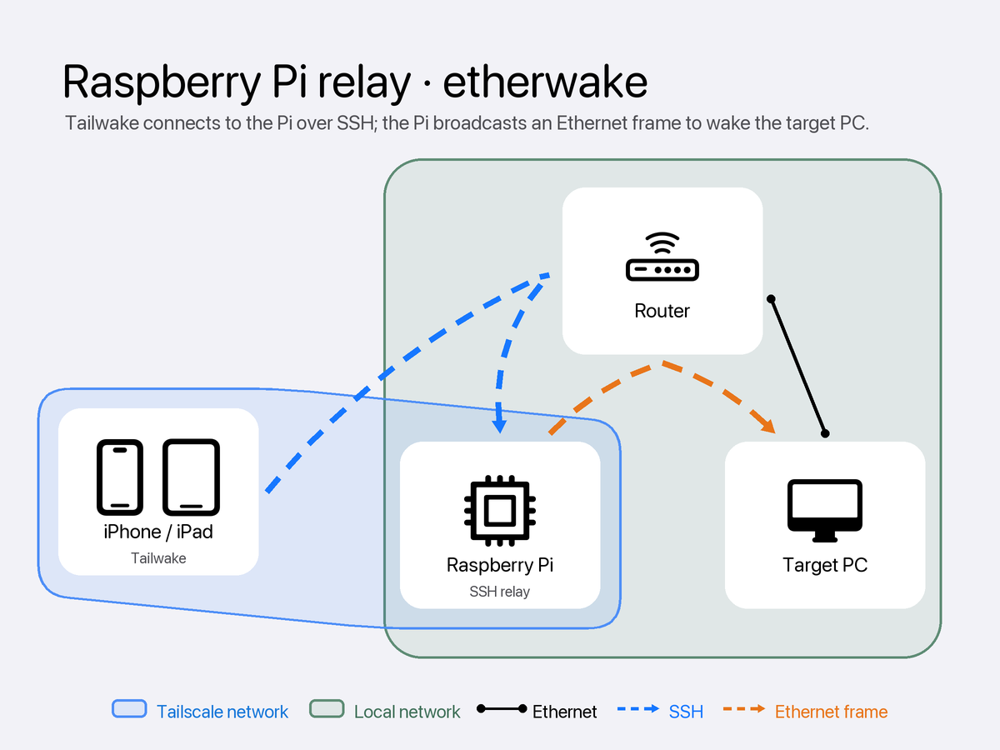
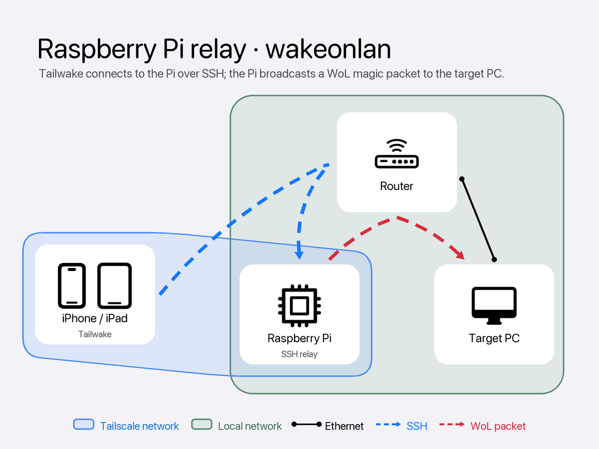

# Tailwake

Wake a computer from your iPhone or iPad—on the same local network or through an SSH relay you control.

Tailwake sends a standard Wake-on-LAN (WoL) magic packet. At home, your phone broadcasts the packet directly. Away from home, Tailwake connects to an always-on device on the target computer’s network and asks that relay to send the wake packet locally.

> Your remote-access path is your choice. [Tailscale](https://tailscale.com/) is a good way to reach a relay privately without opening an inbound router port.

## Before you start

You need:

- An iPhone or iPad running iOS 17 or later
- A target computer and network adapter that support Wake-on-LAN
- The target computer’s MAC address
- For remote wakes, an SSH-capable relay on the target computer’s local network

Enable Wake-on-LAN in the target computer’s firmware and operating-system settings before adding it to Tailwake.

## Wake from the same network

When your iPhone or iPad and the target computer share a local network, choose **Local (UDP)** when adding the computer. Tailwake broadcasts the WoL magic packet directly—no relay is required.

_The screenshot uses fictional sample devices: Media server, PC, and Workstation._

## Wake while away from home

A router or small Linux computer on the target PC’s local network can act as an SSH relay. In Tailwake, choose **Relay (SSH)**, then enter the relay’s address, port, user, authentication method, and wake tool.

The relay receives the SSH connection from Tailwake and broadcasts the wake packet where the target computer can hear it.

### Router as relay

An SSH-capable router can work when it can run the selected wake tool. OpenWrt is a strong choice; Asuswrt-Merlin, FreshTomato, DD-WRT, and Gargoyle can also work when SSH is enabled and the needed wake tool is available.

### Small Linux computer as relay

A Raspberry Pi is one option, but any always-on Linux single-board computer can work when it has SSH, the wake tool, and access to the target computer’s local broadcast or VLAN segment.

### Choose the relay’s wake tool

| Tool | What it sends | What the relay needs |
| --- | --- | --- |
| `etherwake` | A raw Ethernet frame | Root access and the local network interface; supports SecureOn |
| `wakeonlan` | A UDP WoL magic packet | No root access or interface selection; does not support SecureOn |

Whichever relay you use needs SSH access from Tailwake, access to the target computer’s local broadcast or VLAN segment, and the selected wake tool installed.

## Set up a computer in Tailwake

1. Open Tailwake and add a computer.
2. Enter the computer’s name and MAC address.
3. Choose **Local (UDP)** when you are on the same network, or **Relay (SSH)** for remote wakes.
4. For a relay, enter the SSH connection details and select `etherwake` or `wakeonlan`.
5. Test the wake while the computer is still on, before relying on it remotely.

## Private by design

- Tailwake has no account, advertising, analytics, tracking, or developer-run server.
- Device names, addresses, relay settings, and wake history stay on your device.
- SSH credentials and SecureOn passwords are stored in the iOS Keychain.
- The relay’s SSH host key is pinned after its first successful verification.

Use Tailwake only with computers, networks, and relay accounts that you own or are authorized to control. Wake-on-LAN depends on your hardware, operating-system settings, and network; test your configuration before you need it.
