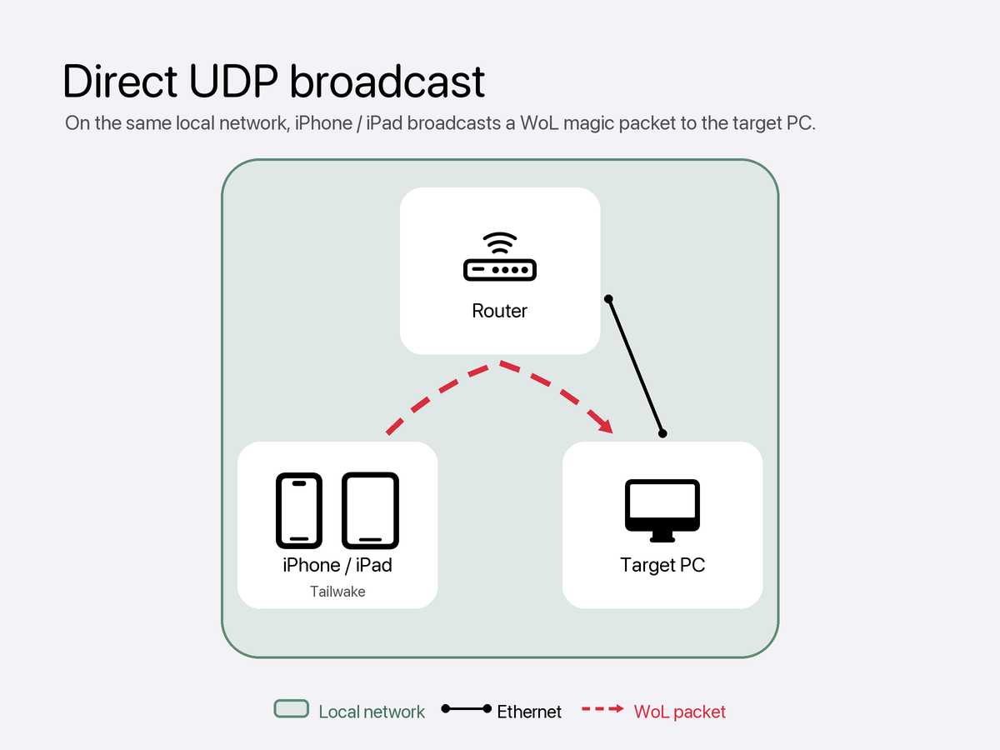
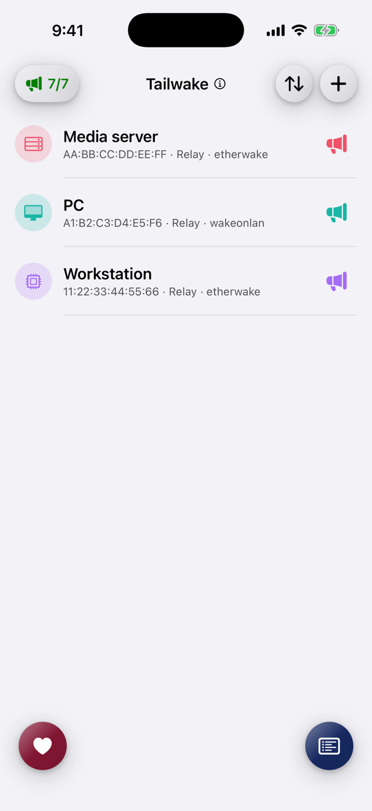
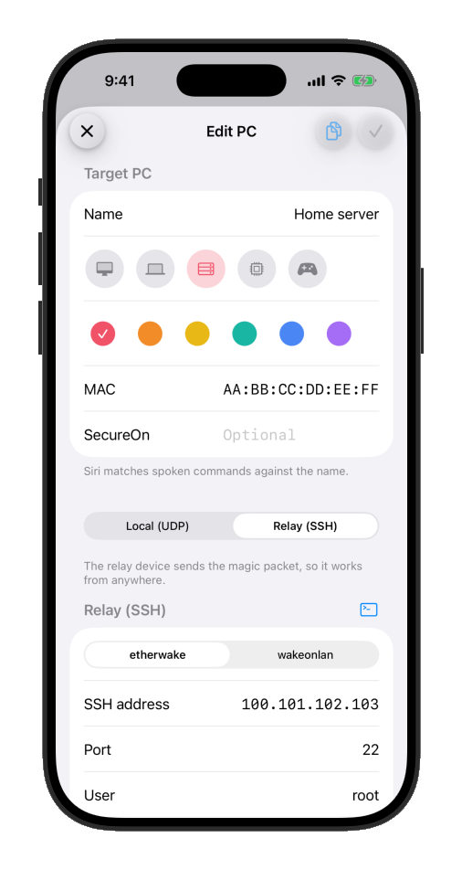
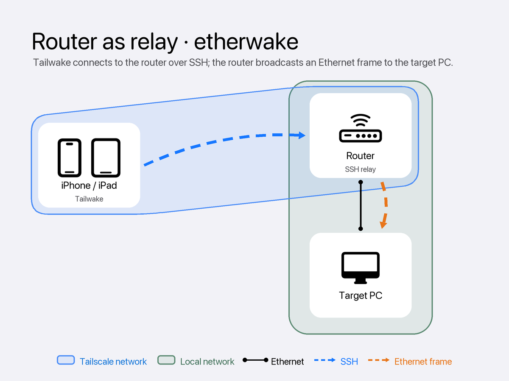
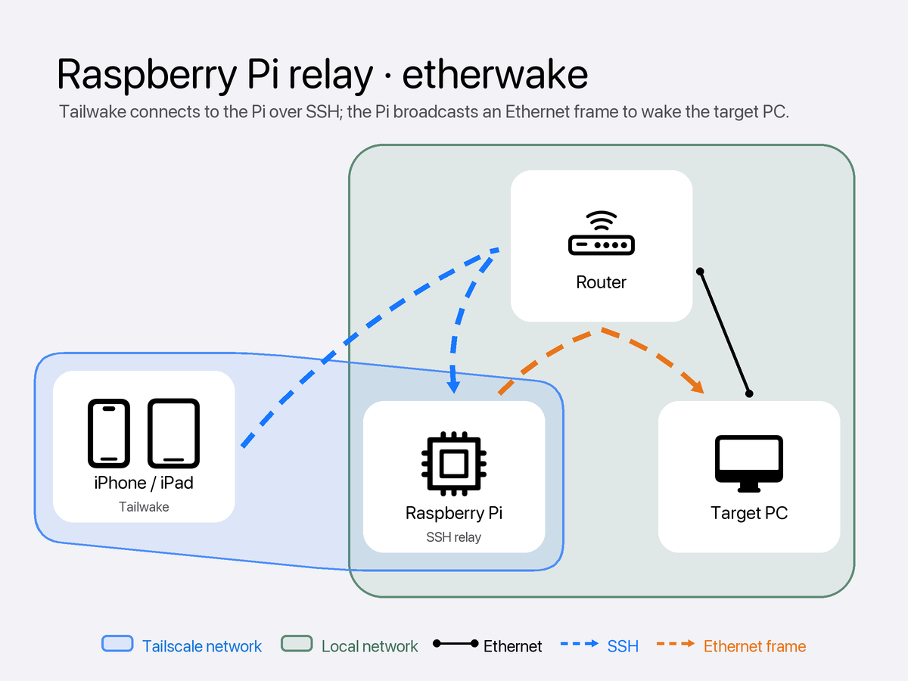
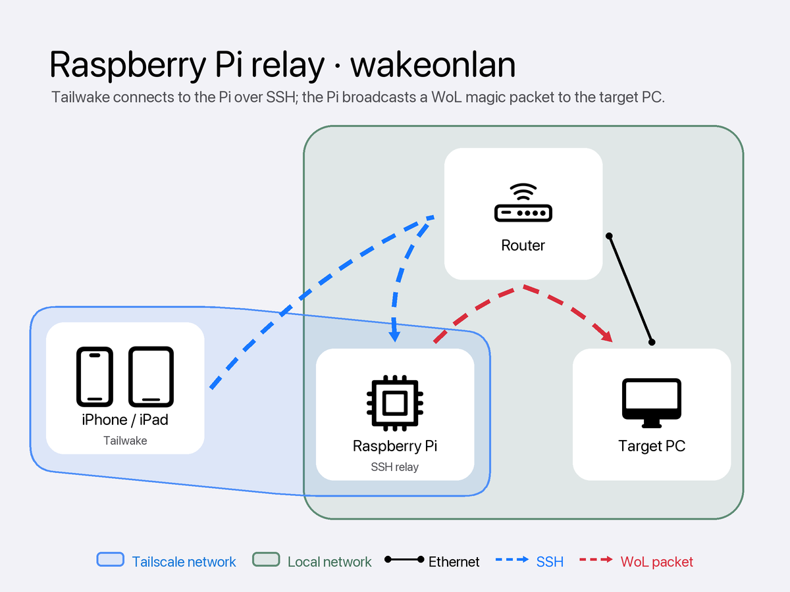

# Tailwake

Wake a PC from your iPhone or iPad—on the same local network or through an SSH relay you control.

Tailwake sends a standard Wake-on-LAN (WoL) magic packet. At home, your device broadcasts the packet directly. Away from home, Tailwake connects to an always-on device on the PC’s network and asks that relay device to send the wake packet locally.

> Your remote-access path is your choice. [Tailscale](https://tailscale.com/) is a good way to reach a relay privately without opening an inbound router port.

## Before you start

You need:

- An iPhone or iPad running iOS 17 or later
- A target computer and network adapter that support Wake-on-LAN
- The target computer’s MAC address
- For remote wakes, an SSH-capable relay on the target computer’s local network

Enable Wake-on-LAN in the target computer’s firmware and operating-system settings before adding it to Tailwake.

Tailwake asks for **Local Network** access to send local wakes. Notifications are optional, but they let Tailwake report that a wake was sent, failed, or was later verified.

## Wake from the same network

When your iPhone or iPad and the target computer share a local network, choose **Local (UDP)** when adding the computer. Tailwake broadcasts the WoL magic packet directly—no relay is required.

_The screenshot uses fictional sample devices: Media server, PC, and Workstation._

## Wake while away from home

A router or small Linux computer on the target PC’s local network can act as an SSH relay. In Tailwake, choose **Relay (SSH)**, then enter the relay device’s address, port, user, authentication method, and wake tool.

The relay device receives the SSH connection from Tailwake and broadcasts the wake packet where the target computer can hear it.

### Router as relay

An SSH-capable router can work when it can run the selected wake tool. OpenWrt is a strong choice; Asuswrt-Merlin, FreshTomato, DD-WRT, and Gargoyle can also work when SSH is enabled and the needed wake tool is available.

### Small Linux computer as relay

A Raspberry Pi is one option, but any always-on Linux single-board computer can work when it has SSH, the wake tool, and access to the target computer’s local broadcast or VLAN segment.

### Choose the relay’s wake tool

| Tool | What it sends | What the relay needs |
| --- | --- | --- |
| `etherwake` | A raw Ethernet frame | Root access and the local network interface; supports SecureOn |
| `wakeonlan` | A UDP WoL magic packet | No root access or interface selection; does not support SecureOn |

Whichever relay you use needs SSH access from Tailwake and access to the target computer’s local broadcast or VLAN segment. Tailwake can show the commands it uses and, after your confirmation, offer to install a missing wake tool with the relay device’s package manager. Installation needs internet access and may need root or passwordless `sudo` on the relay device.

### Relay authentication and security

Tailwake supports SSH password authentication and unencrypted OpenSSH Ed25519 private keys. The relay device must offer an Ed25519 or ECDSA SSH host key; an RSA-only or otherwise obsolete SSH server must be updated before Tailwake can use it.

On a relay’s first successful connection, Tailwake pins its SSH host key. If that key changes later, Tailwake stops before handing over a password or key and asks you to compare the new identity before reconnecting.

## Set up a computer in Tailwake

1. Open Tailwake and add a computer.
2. Enter the computer’s name and MAC address.
3. Choose **Local (UDP)** when you are on the same network, or **Relay (SSH)** for remote wakes.
4. For a relay, enter the SSH connection details, choose password or Ed25519-key authentication, and select `etherwake` or `wakeonlan`.
5. Optionally turn on **Verify** and enter a TCP service on the PC, such as Remote Desktop on port 3389. Tailwake can skip a wake when the PC is already online and check once after a wake.
6. Test the wake while the PC is still on, before relying on it remotely.

## Verify, log, and automate

With **Verify before waking**, Tailwake checks the configured TCP address and port and skips the wake when the PC already answers. With **Verify after waking**, it checks once after the selected 1–60 minute delay (five minutes by default). A reply confirms that service is online; no reply does not necessarily mean the PC is off.

The **Wake Log** keeps each wake attempt, follow-up verification, and relay-tool installation result on your device. You can also use the **Wake PC** action from Siri or Shortcuts to wake one of your saved PCs without opening the app.

## Relay-wake allowance

During the public beta, relay wakes are unlimited through December 31, 2026. After the beta, Tailwake includes seven free relay wakes per calendar month, resetting on the first. Local wakes are always free and unlimited. Monthly or yearly subscriptions and the lifetime unlock provide unlimited relay wakes; optional tips do not unlock features.

## Private by design

- Tailwake has no account, advertising, analytics, tracking, or developer-run server.
- Device names, addresses, relay settings, wake history, and verification results stay on your device.
- SSH credentials and SecureOn passwords are stored in the iOS Keychain.
- Tailwake is available in English and Traditional Chinese.

Use Tailwake only with computers, networks, and relay accounts that you own or are authorized to control. Wake-on-LAN depends on your hardware, operating-system settings, and network; test your configuration before you need it.
