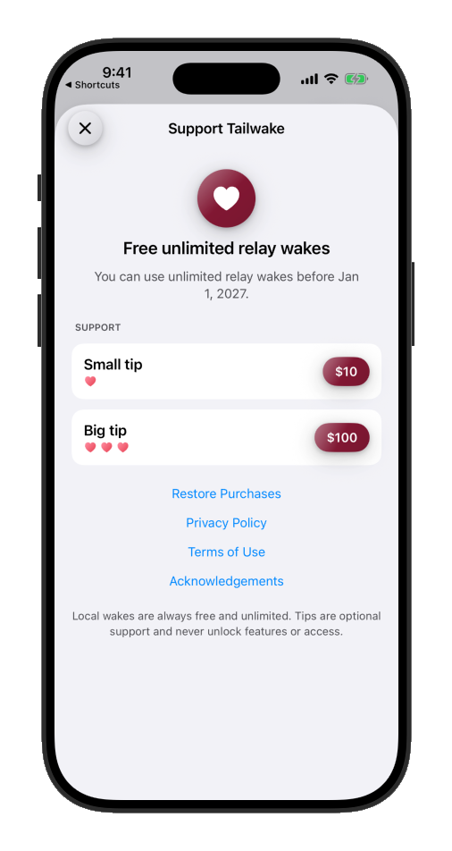
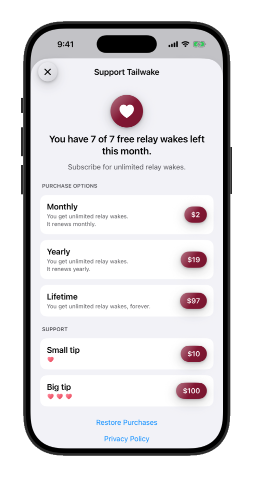

# Support Development

[← Tailwake home](README.md) · [Instructions](INSTRUCTIONS.md) · [Automate Wakes](AUTOMATION.md) · [Privacy Policy](PRIVACY.md) · [Terms of Use](TERMS.md)

Tailwake is designed to remain useful without a subscription. If Tailwake is helpful, the app also offers ways to support its development.

## Through December 31, 2026

Relay wakes are free and unlimited during the beta period through December 31, 2026. Local wakes are always free and unlimited.

  

## Planned from January 1, 2027

The free-unlimited beta period is scheduled to end. The current plan is:

- **Seven free relay wakes** per calendar month, resetting on the first.
- **Subscription (monthly or yearly)** — Unlimited relay wakes while active; renews at the selected interval.
- **Lifetime unlock** — Unlimited relay wakes forever.

  

The screenshot shows the currently planned USD prices: $2 monthly, $19 yearly, and $97 lifetime. Prices, availability, and the planned January 2027 change may vary by App Store storefront or change before they take effect. Monthly and yearly subscriptions renew automatically unless cancelled at least 24 hours before the current period ends; they share one subscription group, so changing plans replaces the current plan.

## Optional tips

The app also offers **Small tip** and **Big tip** purchases. Tips are optional support only: they do not unlock features or relay-wake access.

## Manage or restore a purchase

Use **Restore Purchases** in Tailwake to recover purchases made with the same Apple Account. Manage or cancel a subscription in **Settings > [your name] > Subscriptions** on your Apple device. Apple handles billing, cancellation, and refunds.

For the full purchase terms, see the [Terms of Use](TERMS.md).
